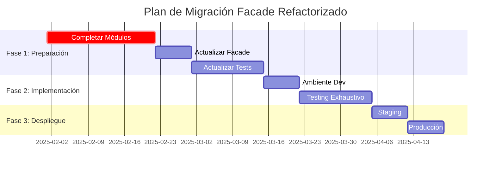

# Plan de Migración por Fases - Facade Refactorizado

## Información del Proyecto

**Proyecto**: Planificador - Client Repository Facade  
**Versión Actual**: Facade Original (1,335 líneas)  
**Versión Objetivo**: Facade Refactorizado (240 líneas)  
**Reducción de Código**: 82%  
**Estado**: PENDIENTE - No implementar hasta completar prerrequisitos

## Prerrequisitos Críticos

### ❌ Bloqueadores Identificados

1. **Módulos Incompletos**
   - `QueryOperations.get_active_clients()` - FALTANTE
   - `ValidationOperations` - Manejo de excepciones incorrecto
   - `StatisticsOperations` - Conflictos de parámetros
   - `exception_handler` - Atributo requerido por tests

2. **Incompatibilidades de Tests**
   - 10/10 tests fallan con facade refactorizado
   - Estructura de mocking incompatible
   - Excepciones con parámetros diferentes

3. **Dependencias de Arquitectura**
   - Tests esperan atributos específicos: `crud_ops`, `query_builder`, `validator`, `statistics`
   - Firmas de métodos diferentes
   - Estructura de errores incompatible

## Fase 1: Preparación de Infraestructura

**Duración Estimada**: 4-6 semanas  
**Prioridad**: CRÍTICA  
**Prerequisito**: Completar antes de cualquier implementación

### 1.1 Completar Módulos Nuevos (2-3 semanas)

#### QueryOperations
```python
# IMPLEMENTAR MÉTODOS FALTANTES
class QueryOperations:
    async def get_active_clients(self, session: AsyncSession) -> List[Client]:
        """Obtener clientes activos - MÉTODO FALTANTE"""
        # TODO: Implementar lógica completa
        pass
    
    async def get_client_by_name(self, session: AsyncSession, name: str) -> Optional[Client]:
        """Verificar implementación completa"""
        # TODO: Validar funcionalidad
        pass
```

#### ValidationOperations
```python
# CORREGIR MANEJO DE EXCEPCIONES
class ValidationOperations:
    def validate_email_format(self, email: str) -> bool:
        """Corregir parámetros de ClientValidationError"""
        if not self._is_valid_email(email):
            # PROBLEMA: Parámetros incorrectos
            raise ClientValidationError(
                message="Email inválido",  # Parámetro correcto
                field="email",            # Parámetro requerido
                value=email               # Parámetro requerido
            )
        return True
```

#### StatisticsOperations
```python
# RESOLVER CONFLICTOS DE PARÁMETROS
class StatisticsOperations:
    async def get_client_statistics(self, session: AsyncSession) -> Dict[str, Any]:
        """Resolver conflictos en RepositoryError"""
        try:
            # Lógica de estadísticas
            pass
        except Exception as e:
            # PROBLEMA: Parámetros incorrectos en RepositoryError
            raise RepositoryError(
                message=f"Error en estadísticas: {e}",
                operation="get_client_statistics",  # Parámetro correcto
                entity_type="Client",               # Parámetro correcto
                original_error=e                    # Parámetro correcto
            )
```

### 1.2 Actualizar Facade Refactorizado (1 semana)

```python
# AGREGAR ATRIBUTO FALTANTE
class ClientRepositoryFacade:
    def __init__(self, session: AsyncSession):
        # Módulos existentes
        self.crud_ops = CRUDOperations(session)
        self.query_ops = QueryOperations(session)
        self.validation_ops = ValidationOperations()
        self.statistics_ops = StatisticsOperations(session)
        
        # AGREGAR: Atributo requerido por tests
        self.exception_handler = ExceptionHandler()  # FALTANTE
        
        # Aliases para compatibilidad con tests
        self.query_builder = self.query_ops
        self.validator = self.validation_ops
        self.statistics = self.statistics_ops
```

### 1.3 Actualizar Tests (1-2 semanas)

#### Modificar Estructura de Tests
```python
# ACTUALIZAR TESTS PARA NUEVA ARQUITECTURA
class TestClientRepositoryFacade:
    @pytest.fixture
    def facade(self, mock_session):
        """Actualizar fixture para nueva estructura"""
        facade = ClientRepositoryFacade(mock_session)
        
        # NUEVO: Mock para módulos individuales
        facade.crud_ops = Mock()
        facade.query_ops = Mock()
        facade.validation_ops = Mock()
        facade.statistics_ops = Mock()
        facade.exception_handler = Mock()  # AGREGAR
        
        return facade
    
    async def test_create_client_success(self, facade, valid_client_data):
        """Actualizar test para nueva estructura"""
        # CAMBIO: Usar módulo específico en lugar de facade directo
        facade.crud_ops.create_client.return_value = Client(**valid_client_data)
        
        result = await facade.create_client(valid_client_data)
        
        # VERIFICAR: Llamada al módulo correcto
        facade.crud_ops.create_client.assert_called_once_with(valid_client_data)
        assert result.name == valid_client_data["name"]
```

## Fase 2: Implementación Gradual

**Duración Estimada**: 2-3 semanas  
**Prerequisito**: Fase 1 completada al 100%

### 2.1 Ambiente de Desarrollo (1 semana)

#### Checklist de Implementación
- [ ] Desplegar facade refactorizado en dev
- [ ] Ejecutar suite completa de tests
- [ ] Validar 100% de tests passing
- [ ] Verificar funcionalidad end-to-end
- [ ] Probar integración con otros módulos

#### Comando de Validación
```bash
# EJECUTAR TESTS COMPLETOS
poetry run pytest src/planificador/tests/unit/test_repositories/test_client_repository_facade.py -v

# RESULTADO ESPERADO: 10/10 PASSED
```

### 2.2 Testing Exhaustivo (1-2 semanas)

#### Tests Unitarios
```bash
# Tests específicos del facade
poetry run pytest src/planificador/tests/unit/test_repositories/ -k "client_repository_facade" -v

# Tests de módulos individuales
poetry run pytest src/planificador/tests/unit/test_repositories/ -k "crud_operations" -v
poetry run pytest src/planificador/tests/unit/test_repositories/ -k "query_operations" -v
poetry run pytest src/planificador/tests/unit/test_repositories/ -k "validation_operations" -v
poetry run pytest src/planificador/tests/unit/test_repositories/ -k "statistics_operations" -v
```

#### Tests de Integración
```bash
# Tests de integración completa
poetry run pytest src/planificador/tests/integration/ -k "client" -v
```

#### Tests de Performance
```python
# CREAR: Tests de performance comparativa
import time
import pytest

def test_facade_performance_comparison():
    """Comparar performance entre facade original y refactorizado"""
    # Medir tiempo facade original
    start_time = time.time()
    # ... operaciones con facade original
    original_time = time.time() - start_time
    
    # Medir tiempo facade refactorizado
    start_time = time.time()
    # ... operaciones con facade refactorizado
    refactored_time = time.time() - start_time
    
    # VALIDAR: Mejora o mantenimiento de performance
    assert refactored_time <= original_time * 1.1  # Máximo 10% más lento
```

## Fase 3: Despliegue Controlado

**Duración Estimada**: 1-2 semanas  
**Prerequisito**: Fase 2 completada con 100% éxito

### 3.1 Ambiente de Staging (1 semana)

#### Checklist de Staging
- [ ] Desplegar en ambiente de staging
- [ ] Ejecutar pruebas de usuario
- [ ] Monitorear performance durante 48 horas
- [ ] Validar logs de errores (0 errores críticos)
- [ ] Probar rollback plan

#### Métricas de Validación
```yaml
# MÉTRICAS REQUERIDAS PARA APROBAR STAGING
performance:
  response_time_avg: "<= 100ms"  # Tiempo de respuesta promedio
  memory_usage: "<= baseline + 10%"  # Uso de memoria
  cpu_usage: "<= baseline + 5%"   # Uso de CPU

reliability:
  error_rate: "0%"  # Tasa de errores críticos
  uptime: "100%"    # Tiempo de actividad
  
functionality:
  tests_passing: "100%"  # Tests pasando
  features_working: "100%"  # Funcionalidades operativas
```

### 3.2 Producción (1 semana)

#### Estrategia de Despliegue

1. **Blue-Green Deployment**
   - Mantener facade original (Blue)
   - Desplegar facade refactorizado (Green)
   - Cambio gradual de tráfico: 10% → 50% → 100%

2. **Rollback Plan**
   ```bash
   # PLAN DE ROLLBACK INMEDIATO
   # Si se detectan errores críticos:
   
   # 1. Restaurar facade original
   cp client_repository_facade_backup.py client_repository_facade.py
   
   # 2. Reiniciar servicios
   poetry run python -m planificador.main restart
   
   # 3. Validar funcionamiento
   poetry run pytest src/planificador/tests/unit/test_repositories/test_client_repository_facade.py
   ```

3. **Monitoreo Intensivo**
   - Logs en tiempo real durante primeras 24 horas
   - Alertas automáticas para errores críticos
   - Métricas de performance cada 5 minutos
   - Validación de funcionalidad cada hora

## Criterios de Éxito

### ✅ Criterios Obligatorios

1. **Tests**: 100% passing (10/10)
2. **Performance**: Sin degradación > 10%
3. **Errores**: 0 errores críticos en producción
4. **Funcionalidad**: Todas las operaciones CRUD funcionando
5. **Compatibilidad**: Sin ruptura de APIs existentes

### 📊 Métricas de Validación

```python
# MÉTRICAS FINALES ESPERADAS
metrics = {
    "code_reduction": "82%",           # Reducción de líneas de código
    "maintainability": "Mejorada",     # Facilidad de mantenimiento
    "modularity": "Alta",             # Separación de responsabilidades
    "test_coverage": "100%",          # Cobertura de tests
    "performance": "Mantenida/Mejorada", # Performance
    "error_rate": "0%",               # Tasa de errores
}
```

## Riesgos y Mitigaciones

### 🚨 Riesgos Identificados

1. **Riesgo Alto**: Incompatibilidades no detectadas
   - **Mitigación**: Testing exhaustivo en cada fase
   - **Plan B**: Rollback inmediato disponible

2. **Riesgo Medio**: Degradación de performance
   - **Mitigación**: Monitoreo continuo de métricas
   - **Plan B**: Optimización específica o rollback

3. **Riesgo Bajo**: Problemas de integración
   - **Mitigación**: Tests de integración completos
   - **Plan B**: Corrección incremental

### 🛡️ Estrategias de Mitigación

1. **Backup Completo**: Mantener facade original como respaldo
2. **Testing Progresivo**: Validación en cada fase antes de continuar
3. **Monitoreo Continuo**: Alertas automáticas para problemas
4. **Rollback Rápido**: Plan de reversión en < 5 minutos
5. **Documentación Completa**: Guías de troubleshooting

## Cronograma Detallado



## Decisión Final

### ❌ ESTADO ACTUAL: NO IMPLEMENTAR

**Razón**: Prerrequisitos críticos no completados

### ✅ PRÓXIMOS PASOS RECOMENDADOS

1. **Mantener facade original** hasta completar Fase 1
2. **Priorizar completar módulos nuevos** si se requiere funcionalidad adicional
3. **Reevaluar en 6 meses** cuando infraestructura esté madura
4. **Usar este plan** como guía para implementación futura

---

**Fecha de Creación**: Enero 2025  
**Estado**: PLAN PREPARADO - PENDIENTE DE EJECUCIÓN  
**Próxima Revisión**: Julio 2025  
**Responsable**: Equipo de Arquitectura