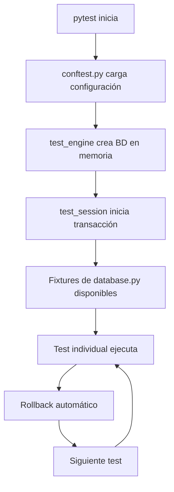

# Esquema Detallado para Implementación de Pruebas de Modelos

**Fecha de creación**: 21 de agosto de 2025  
**Proyecto**: Planificador de Horarios  
**Versión**: 1.0

## 📋 Índice

1. [Estructura General](#estructura-general)
2. [Componentes Existentes](#componentes-existentes)
3. [Arquitectura de Testing](#arquitectura-de-testing)
4. [Implementación por Categorías](#implementación-por-categorías)
5. [Fixtures y Utilidades](#fixtures-y-utilidades)
6. [Configuración y Herramientas](#configuración-y-herramientas)
7. [Patrones de Implementación](#patrones-de-implementación)
8. [Comandos de Ejecución](#comandos-de-ejecución)
9. [Checklist de Implementación](#checklist-de-implementación)

---

## 🏗️ Estructura General

### Directorio Base de Tests
```
c:\Users\raare\Documents\Personal\01Trabajo\AkGroup\Planificador2\src\planificador\tests\
├── conftest.py                    # Configuración global de pytest
├── fixtures\                      # Fixtures reutilizables
│   ├── __init__.py
│   └── database.py                # Fixtures de base de datos y modelos
├── unit\                          # Tests unitarios
│   └── test_models\               # Tests específicos de modelos
│       ├── __init__.py
│       ├── test_client.py         # Tests del modelo Client
│       ├── test_employee.py       # Tests del modelo Employee
│       ├── test_project.py        # Tests del modelo Project
│       ├── test_team.py           # Tests del modelo Team
│       ├── test_schedule.py       # Tests del modelo Schedule
│       ├── test_workload.py       # Tests del modelo Workload
│       ├── test_team_membership.py # Tests del modelo TeamMembership
│       ├── test_status_code.py    # Tests del modelo StatusCode
│       ├── test_vacation.py       # Tests del modelo Vacation
│       └── test_model_relationships.py # Tests centralizados de relaciones
├── integration\                   # Tests de integración
├── performance\                   # Tests de rendimiento
└── test_fixtures_validation.py   # Validación de fixtures
```

---

## 🔧 Componentes Existentes

### 1. Configuración Global (`conftest.py`)
**Ubicación**: `c:\Users\raare\Documents\Personal\01Trabajo\AkGroup\Planificador2\src\planificador\tests\conftest.py`

**Fixtures Disponibles**:
- `test_engine`: Motor SQLAlchemy asíncrono para testing
- `test_session`: Sesión de base de datos con rollback automático
- `override_get_session`: Sobrescritura de dependencias
- `db_session`: Sesión alternativa con manejo de transacciones

**Características**:
- Base de datos en memoria SQLite (`sqlite+aiosqlite:///:memory:`)
- Rollback automático por test
- Configuración de pytest-asyncio
- Importación automática de fixtures desde `database.py`

### 2. Fixtures de Base de Datos (`fixtures/database.py`)
**Ubicación**: `c:\Users\raare\Documents\Personal\01Trabajo\AkGroup\Planificador2\src\planificador\tests\fixtures\database.py`

**Fixtures Implementadas**:
- `sample_client`: Cliente de prueba con datos únicos
- `sample_employee`: Empleado de prueba con datos únicos
- `sample_team`: Equipo de prueba básico
- `generate_unique_code()`: Función para generar códigos únicos

**Patrón de Implementación**:
```python
@pytest.fixture
async def sample_model(test_session: AsyncSession) -> Model:
    """Fixture que crea un modelo de prueba."""
    unique_id = str(uuid.uuid4())[:8].upper()
    model = Model(
        # Campos con datos únicos
        field=f"Value-{unique_id}"
    )
    
    test_session.add(model)
    await test_session.flush()
    await test_session.refresh(model)
    
    return model
```

### 3. Tests de Modelos Existentes
**Ubicación**: `c:\Users\raare\Documents\Personal\01Trabajo\AkGroup\Planificador2\src\planificador\tests\unit\test_models\`

**Archivos Implementados**:
- `test_client.py` (307 líneas)
- `test_employee.py`
- `test_project.py`
- `test_team.py`
- `test_schedule.py`
- `test_workload.py`
- `test_team_membership.py`
- `test_status_code.py`
- `test_vacation.py`
- `test_model_relationships.py` (centralizado)

---

## 🏛️ Arquitectura de Testing

### Principios de Diseño

1. **Separación de Responsabilidades**:
   - Tests unitarios por modelo individual
   - Tests de relaciones centralizados
   - Fixtures reutilizables separadas

2. **Reutilización de Código**:
   - Fixtures compartidas en `database.py`
   - Configuración global en `conftest.py`
   - Utilidades comunes para generación de datos

3. **Aislamiento de Tests**:
   - Base de datos en memoria por sesión
   - Rollback automático por test
   - Datos únicos para evitar conflictos

4. **Escalabilidad**:
   - Estructura modular por modelo
   - Patrones consistentes
   - Fácil adición de nuevos tests

### Flujo de Ejecución



---

## 📝 Implementación por Categorías

### 1. Tests de Validación de Modelos

**Objetivo**: Validar constraints, tipos de datos y reglas de negocio

**Estructura por Archivo**:
```python
class TestModelValidation:
    """Tests de validación del modelo."""
    
    async def test_valid_creation(self, test_session):
        """Test creación válida del modelo."""
        
    async def test_required_fields(self, test_session):
        """Test campos obligatorios."""
        
    async def test_field_constraints(self, test_session):
        """Test constraints de campos."""
        
    async def test_unique_constraints(self, test_session):
        """Test constraints de unicidad."""
```

**Ejemplo de Implementación**:
```python
# test_client.py
class TestClientValidation:
    async def test_email_validation(self, test_session: AsyncSession):
        """Test validación de formato de email."""
        with pytest.raises(IntegrityError):
            client = Client(
                name="Test Client",
                code="TC001",
                email="invalid-email"  # Email inválido
            )
            test_session.add(client)
            await test_session.flush()
```

### 2. Tests de Relaciones entre Modelos

**Archivo Centralizado**: `test_model_relationships.py`

**Estructura**:
```python
class TestClientProjectRelationship:
    """Tests de relación Client-Project."""
    
class TestTeamMembershipRelationship:
    """Tests de relación Team-Employee."""
    
class TestProjectWorkloadRelationship:
    """Tests de relación Project-Workload."""
    
class TestEmployeeWorkloadRelationship:
    """Tests de relación Employee-Workload."""
    
class TestEmployeeScheduleRelationship:
    """Tests de relación Employee-Schedule."""
    
class TestCascadeDeletes:
    """Tests de eliminación en cascada."""
```

### 3. Tests de Métodos Personalizados

**Objetivo**: Validar métodos específicos del modelo

**Estructura**:
```python
class TestModelMethods:
    """Tests de métodos personalizados del modelo."""
    
    async def test_string_representation(self, sample_model):
        """Test método __str__ del modelo."""
        
    async def test_custom_method(self, sample_model):
        """Test método personalizado específico."""
```

### 4. Tests de Casos Límite

**Objetivo**: Validar comportamiento en situaciones extremas

**Estructura**:
```python
class TestModelEdgeCases:
    """Tests de casos límite del modelo."""
    
    async def test_maximum_length_fields(self, test_session):
        """Test campos con longitud máxima."""
        
    async def test_null_optional_fields(self, test_session):
        """Test campos opcionales con valores nulos."""
        
    async def test_boundary_values(self, test_session):
        """Test valores en los límites permitidos."""
```

---

## 🔨 Fixtures y Utilidades

### Fixtures Existentes en `database.py`

```python
# Fixtures básicas implementadas
@pytest.fixture
async def sample_client(test_session: AsyncSession) -> Client:
    """Cliente de prueba con datos únicos."""

@pytest.fixture
async def sample_employee(test_session: AsyncSession) -> Employee:
    """Empleado de prueba con datos únicos."""

@pytest.fixture
async def sample_team(test_session: AsyncSession) -> Team:
    """Equipo de prueba básico."""
```

### Fixtures Recomendadas para Implementar

```python
# Fixtures adicionales recomendadas
@pytest.fixture
async def sample_project(test_session: AsyncSession, sample_client: Client) -> Project:
    """Proyecto de prueba asociado a cliente."""

@pytest.fixture
async def sample_schedule(test_session: AsyncSession, sample_employee: Employee) -> Schedule:
    """Horario de prueba asociado a empleado."""

@pytest.fixture
async def sample_workload(test_session: AsyncSession, sample_employee: Employee, sample_project: Project) -> Workload:
    """Carga de trabajo de prueba."""

@pytest.fixture
async def sample_team_membership(test_session: AsyncSession, sample_team: Team, sample_employee: Employee) -> TeamMembership:
    """Membresía de equipo de prueba."""

# Fixtures de datos complejos
@pytest.fixture
async def project_with_workloads(test_session: AsyncSession) -> Project:
    """Proyecto con múltiples cargas de trabajo."""

@pytest.fixture
async def team_with_members(test_session: AsyncSession) -> Team:
    """Equipo con múltiples miembros."""

@pytest.fixture
async def employee_with_full_schedule(test_session: AsyncSession) -> Employee:
    """Empleado con horarios completos."""
```

### Utilidades de Generación de Datos

```python
# Funciones utilitarias existentes y recomendadas
def generate_unique_code(prefix: str = "TEST") -> str:
    """Genera código único para testing."""
    return f"{prefix}-{str(uuid.uuid4())[:8].upper()}"

def generate_unique_email(domain: str = "test.com") -> str:
    """Genera email único para testing."""
    unique_id = str(uuid.uuid4())[:8].lower()
    return f"user-{unique_id}@{domain}"

def generate_test_date(days_offset: int = 0) -> date:
    """Genera fecha de prueba con offset."""
    from datetime import date, timedelta
    return date.today() + timedelta(days=days_offset)

def generate_test_datetime(hours_offset: int = 0) -> datetime:
    """Genera datetime de prueba con offset."""
    from datetime import datetime, timedelta
    return datetime.now() + timedelta(hours=hours_offset)
```

---

## ⚙️ Configuración y Herramientas

### Configuración de pytest (`pyproject.toml`)

```toml
[tool.pytest.ini_options]
asyncio_mode = "auto"
testpaths = ["src/planificador/tests"]
pythonpath = ["src"]
python_files = ["test_*.py"]
python_classes = ["Test*"]
python_functions = ["test_*"]
addopts = "-v --tb=long"
```

### Dependencias de Testing

```toml
[tool.poetry.group.dev.dependencies]
pytest = "^8.4.1"              # Framework de testing
pytest-asyncio = "^0.23.0"     # Soporte asíncrono
pytest-cov = "^6.2.1"          # Cobertura de código
coverage = "^7.10.0"           # Reportes de cobertura
ruff = "^0.12.4"               # Linting y formateo
```

### Herramientas de Calidad

1. **Ruff**: Linting y formateo automático
2. **Coverage**: Análisis de cobertura de código
3. **pytest-cov**: Integración de cobertura con pytest
4. **pytest-asyncio**: Soporte para tests asíncronos

---

## 🎯 Patrones de Implementación

### 1. Patrón de Test de Modelo Básico

```python
class TestModelName:
    """Tests para el modelo ModelName."""
    
    @pytest_asyncio.fixture
    async def sample_data(self):
        """Datos de ejemplo para el modelo."""
        return {
            "field1": "value1",
            "field2": "value2"
        }
    
    async def test_valid_creation(self, test_session: AsyncSession, sample_data):
        """Test creación válida del modelo."""
        model = ModelName(**sample_data)
        test_session.add(model)
        await test_session.flush()
        await test_session.refresh(model)
        
        assert model.id is not None
        assert model.field1 == sample_data["field1"]
    
    async def test_string_representation(self, sample_model):
        """Test representación string del modelo."""
        str_repr = str(sample_model)
        assert sample_model.name in str_repr
```

### 2. Patrón de Test de Validación

```python
class TestModelValidation:
    """Tests de validación del modelo."""
    
    async def test_required_field_validation(self, test_session: AsyncSession):
        """Test validación de campo obligatorio."""
        with pytest.raises(IntegrityError):
            model = ModelName()  # Sin campos obligatorios
            test_session.add(model)
            await test_session.flush()
    
    async def test_unique_constraint(self, test_session: AsyncSession):
        """Test constraint de unicidad."""
        # Crear primer modelo
        model1 = ModelName(unique_field="test_value")
        test_session.add(model1)
        await test_session.flush()
        
        # Intentar crear segundo modelo con mismo valor único
        with pytest.raises(IntegrityError):
            model2 = ModelName(unique_field="test_value")
            test_session.add(model2)
            await test_session.flush()
```

### 3. Patrón de Test de Relaciones

```python
class TestModelRelationships:
    """Tests de relaciones del modelo."""
    
    async def test_one_to_many_relationship(self, sample_parent, sample_child):
        """Test relación uno a muchos."""
        # Verificar relación directa
        assert sample_child.parent_id == sample_parent.id
        assert sample_child in sample_parent.children
        
        # Verificar backref
        assert sample_child.parent == sample_parent
    
    async def test_cascade_delete(self, test_session: AsyncSession, sample_parent):
        """Test eliminación en cascada."""
        parent_id = sample_parent.id
        child_ids = [child.id for child in sample_parent.children]
        
        # Eliminar padre
        await test_session.delete(sample_parent)
        await test_session.flush()
        
        # Verificar que hijos también se eliminaron
        for child_id in child_ids:
            child = await test_session.get(ChildModel, child_id)
            assert child is None
```

### 4. Patrón de Test de Casos Límite

```python
class TestModelEdgeCases:
    """Tests de casos límite del modelo."""
    
    async def test_maximum_length_field(self, test_session: AsyncSession):
        """Test campo con longitud máxima."""
        max_length = 255
        long_value = "a" * max_length
        
        model = ModelName(text_field=long_value)
        test_session.add(model)
        await test_session.flush()
        
        assert model.text_field == long_value
    
    async def test_field_too_long(self, test_session: AsyncSession):
        """Test campo que excede longitud máxima."""
        max_length = 255
        too_long_value = "a" * (max_length + 1)
        
        with pytest.raises(IntegrityError):
            model = ModelName(text_field=too_long_value)
            test_session.add(model)
            await test_session.flush()
```

---

## 🚀 Comandos de Ejecución

### Comandos Básicos con Poetry

```bash
# Ejecutar todos los tests de modelos
poetry run pytest src/planificador/tests/unit/test_models/ -v

# Ejecutar tests de un modelo específico
poetry run pytest src/planificador/tests/unit/test_models/test_client.py -v

# Ejecutar tests con cobertura
poetry run pytest src/planificador/tests/unit/test_models/ --cov=src/planificador/models --cov-report=html

# Ejecutar tests de relaciones centralizadas
poetry run pytest src/planificador/tests/unit/test_models/test_model_relationships.py -v

# Ejecutar tests con output detallado
poetry run pytest src/planificador/tests/unit/test_models/ -v -s

# Ejecutar tests en paralelo (si se instala pytest-xdist)
poetry run pytest src/planificador/tests/unit/test_models/ -n auto
```

### Comandos de Calidad de Código

```bash
# Linting con Ruff
poetry run ruff check src/planificador/tests/unit/test_models/

# Formateo con Ruff
poetry run ruff format src/planificador/tests/unit/test_models/

# Verificar cobertura mínima
poetry run pytest src/planificador/tests/unit/test_models/ --cov=src/planificador/models --cov-fail-under=80
```

### Comandos de Debugging

```bash
# Ejecutar tests con debugging
poetry run pytest src/planificador/tests/unit/test_models/test_client.py::TestClientModel::test_creation -v -s --pdb

# Ejecutar tests con logging SQL
poetry run pytest src/planificador/tests/unit/test_models/ -v --log-cli-level=DEBUG

# Ejecutar solo tests que fallan
poetry run pytest src/planificador/tests/unit/test_models/ --lf
```

---

## ✅ Checklist de Implementación

### Fase 1: Configuración Base
- [x] ✅ `conftest.py` configurado con fixtures básicas
- [x] ✅ `database.py` con fixtures de modelos principales
- [x] ✅ Configuración de pytest en `pyproject.toml`
- [x] ✅ Dependencias de testing instaladas

### Fase 2: Tests de Modelos Individuales
- [x] ✅ `test_client.py` - Tests del modelo Client
- [x] ✅ `test_employee.py` - Tests del modelo Employee
- [x] ✅ `test_project.py` - Tests del modelo Project
- [x] ✅ `test_team.py` - Tests del modelo Team
- [x] ✅ `test_schedule.py` - Tests del modelo Schedule
- [x] ✅ `test_workload.py` - Tests del modelo Workload
- [x] ✅ `test_team_membership.py` - Tests del modelo TeamMembership
- [x] ✅ `test_status_code.py` - Tests del modelo StatusCode
- [x] ✅ `test_vacation.py` - Tests del modelo Vacation

### Fase 3: Tests de Relaciones
- [x] ✅ `test_model_relationships.py` - Tests centralizados de relaciones
- [x] ✅ Tests de relaciones Client-Project
- [x] ✅ Tests de relaciones Team-Employee
- [x] ✅ Tests de relaciones Employee-Workload
- [x] ✅ Tests de relaciones Employee-Schedule
- [x] ✅ Tests de eliminación en cascada

### Fase 4: Fixtures Avanzadas
- [ ] 🔄 Fixtures para modelos faltantes (Project, Schedule, Workload, etc.)
- [ ] 🔄 Fixtures de datos complejos (proyectos con workloads, equipos con miembros)
- [ ] 🔄 Utilidades de generación de datos adicionales
- [ ] 🔄 Fixtures para casos de prueba específicos

### Fase 5: Tests Avanzados
- [ ] 🔄 Tests de validación exhaustivos
- [ ] 🔄 Tests de casos límite
- [ ] 🔄 Tests de performance básicos
- [ ] 🔄 Tests de concurrencia

### Fase 6: Optimización y Documentación
- [ ] 🔄 Optimización de fixtures para mejor performance
- [ ] 🔄 Documentación de patrones de testing
- [ ] 🔄 Configuración de CI/CD para tests automáticos
- [ ] 🔄 Métricas de cobertura de código

---

## 📊 Métricas y Objetivos

### Objetivos de Cobertura
- **Modelos**: 95% de cobertura mínima
- **Relaciones**: 100% de cobertura
- **Validaciones**: 100% de cobertura
- **Métodos personalizados**: 90% de cobertura

### Métricas de Calidad
- **Tests por modelo**: Mínimo 15 tests
- **Tiempo de ejecución**: Máximo 30 segundos para suite completa
- **Mantenibilidad**: Reutilización de fixtures >80%
- **Legibilidad**: Documentación completa en todos los tests

---

## 🔗 Referencias y Recursos

### Documentación Oficial
- [Pytest Documentation](https://docs.pytest.org/)
- [SQLAlchemy Testing](https://docs.sqlalchemy.org/en/20/orm/session_transaction.html#joining-a-session-into-an-external-transaction-such-as-for-test-suites)
- [pytest-asyncio](https://pytest-asyncio.readthedocs.io/)

### Mejores Prácticas
- [Testing Best Practices](https://docs.python-guide.org/writing/tests/)
- [SQLAlchemy Testing Patterns](https://docs.sqlalchemy.org/en/20/orm/session_transaction.html)
- [Async Testing Patterns](https://pytest-asyncio.readthedocs.io/en/latest/concepts.html)

### Herramientas del Proyecto
- **Poetry**: Gestión de dependencias
- **Ruff**: Linting y formateo
- **Coverage**: Análisis de cobertura
- **Loguru**: Logging estructurado

---

**Nota**: Este esquema debe actualizarse conforme evolucione el proyecto y se identifiquen nuevas necesidades de testing.