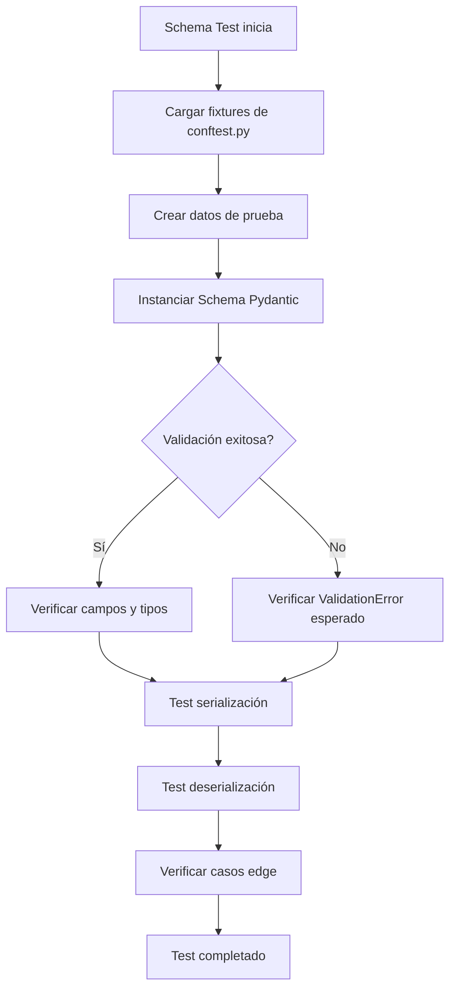

# Esquema Detallado para Implementación de Pruebas de Schemas

**Fecha de creación**: 22 de agosto de 2025  
**Última actualización**: 22 de agosto de 2025 - 22:49  
**Proyecto**: Planificador de Horarios  
**Versión**: 1.5

## 📋 Índice

1. [Estructura General](#estructura-general)
2. [Componentes Existentes](#componentes-existentes)
3. [Arquitectura de Testing de Schemas](#arquitectura-de-testing-de-schemas)
4. [Implementación por Categorías](#implementación-por-categorías)
5. [Fixtures y Utilidades](#fixtures-y-utilidades)
6. [Configuración y Herramientas](#configuración-y-herramientas)
7. [Patrones de Implementación](#patrones-de-implementación)
8. [Comandos de Ejecución](#comandos-de-ejecución)
9. [Checklist de Implementación](#checklist-de-implementación)

---

## 🏗️ Estructura General

### Directorio Base de Tests de Schemas
```
c:\Users\raare\Documents\Personal\01Trabajo\AkGroup\Planificador2\src\planificador\tests\unit\test_schemas\
├── __init__.py
├── conftest.py                    # Configuración específica para tests de schemas
├── test_base_schemas.py           # Tests de schemas Base ✅ IMPLEMENTADO
├── test_client_schemas.py         # Tests de schemas de Client
├── test_employee_schemas.py       # Tests de schemas de Employee
├── test_project_schemas.py        # Tests de schemas de Project
├── test_team_schemas.py           # Tests de schemas de Team ✅ IMPLEMENTADO
├── test_schedule_schemas.py       # Tests de schemas de Schedule ✅ IMPLEMENTADO
├── test_vacation_schemas.py       # Tests de schemas de Vacation ✅ IMPLEMENTADO
├── test_workload_schemas.py       # Tests de schemas de Workload ✅ IMPLEMENTADO
├── test_assignment_schemas.py     # Tests de schemas de Assignment ✅ IMPLEMENTADO
├── test_alert_schemas.py          # Tests de schemas de Alert ✅ IMPLEMENTADO
└── test_response_schemas.py       # Tests de schemas de Response ✅ IMPLEMENTADO
```

### Estructura de Schemas del Proyecto
```
c:\Users\raare\Documents\Personal\01Trabajo\AkGroup\Planificador2\src\planificador\schemas\
├── __init__.py
├── base\                          # Schemas base
│   └── base.py
├── client\                        # Schemas de Client
│   └── client.py
├── employee\                      # Schemas de Employee
│   └── employee.py
├── project\                       # Schemas de Project
│   └── project.py
├── team\                          # Schemas de Team
│   └── team.py
├── schedule\                      # Schemas de Schedule
│   └── schedule.py
├── workload\                      # Schemas de Workload
│   └── workload.py
├── assignment\                    # Schemas de Assignment
│   └── assignment.py
├── vacation\                      # Schemas de Vacation
│   └── vacation.py
├── alert\                         # Schemas de Alert
│   ├── alert.py
│   └── status_code.py
└── response\                      # Schemas de Response
    ├── __init__.py
    └── response_schemas.py
```

---

## 🔧 Componentes Existentes

### 1. Configuración Específica de Schemas (`test_schemas/conftest.py`)
**Ubicación**: `c:\Users\raare\Documents\Personal\01Trabajo\AkGroup\Planificador2\src\planificador\tests\unit\test_schemas\conftest.py`

**Estructura Modular de Fixtures**:
El sistema de fixtures se ha reorganizado en módulos especializados ubicados en `fixtures/`:

- `fixtures/client.py`: Fixtures para schemas de Client
- `fixtures/employee.py`: Fixtures para schemas de Employee  
- `fixtures/project.py`: Fixtures para schemas de Project
- `fixtures/team.py`: Fixtures para schemas de Team
- `fixtures/schedule.py`: Fixtures para schemas de Schedule
- `fixtures/vacation.py`: Fixtures para schemas de Vacation
- `fixtures/workload.py`: Fixtures para schemas de Workload

**Características**:
- Fixtures específicas para validación de Pydantic
- Datos de prueba sin dependencias de base de datos
- Generación de datos únicos para evitar conflictos
- Casos edge predefinidos para reutilización
- Importación automática a través de `conftest.py`
- Organización modular por dominio

### 2. Tests de Schemas Implementados

#### A. Base Schemas (`test_base_schemas.py`)
**Estado**: ✅ Completamente implementado
**Schemas Cubiertos**:
- `BaseSchema`: Schema base del sistema con configuración ORM

**Tests Implementados**:
- Validación de herencia de BaseModel
- Validación de configuración ORM (`from_attributes=True`)
- Tests de instanciación y configuración
- Tests de manejo de objetos ORM
- Tests de serialización/deserialización
- Tests de validación de datos
- Tests de acceso a campos y métodos
- Tests de igualdad y representación
- Tests de copia de instancias
- Tests de información de campos
- Tests de casos edge (schemas vacíos, herencia múltiple)
- Tests de schemas anidados y tipos complejos
- Tests de herencia de configuración

**Cobertura**: 17 tests con 100% de cobertura de código

#### B. Client Schemas (`test_client_schemas.py`)
**Estado**: ✅ Completamente implementado
**Schemas Cubiertos**:
- `ClientBase`: Validaciones básicas
- `ClientCreate`: Creación de clientes
- `ClientUpdate`: Actualización de clientes
- `Client`: Schema completo con ID
- `ClientWithProjects`: Cliente con proyectos relacionados

**Tests Implementados**:
- Validación de campos obligatorios
- Validación de formato de email
- Validación de longitudes máximas
- Serialización/deserialización
- Casos edge (emails inválidos, campos vacíos)

#### C. Employee Schemas (`test_employee_schemas.py`)
**Estado**: ✅ Completamente implementado
**Schemas Cubiertos**:
- `EmployeeBase`: Validaciones básicas
- `EmployeeCreate`: Creación de empleados
- `EmployeeUpdate`: Actualización de empleados
- `Employee`: Schema completo con ID
- `EmployeeWithSchedules`: Empleado con horarios
- `EmployeeWithWorkloads`: Empleado con cargas de trabajo

**Tests Implementados**:
- Validación de EmployeeStatus enum
- Validación de códigos únicos
- Validación de emails
- Campos opcionales y valores por defecto
- Serialización/deserialización

#### D. Project Schemas (`test_project_schemas.py`)
**Estado**: ✅ Completamente implementado
**Schemas Cubiertos**:
- `ProjectBase`: Validaciones básicas
- `ProjectCreate`: Creación de proyectos
- `ProjectUpdate`: Actualización de proyectos
- `Project`: Schema completo con ID
- `ProjectWithAssignments`: Proyecto con asignaciones

**Tests Implementados**:
- Validación de ProjectStatus y ProjectPriority enums
- Validación de fechas (start_date, end_date)
- Validación de duración de proyecto
- Validación de orden de fechas
- Relaciones con Client

#### E. Team Schemas (`test_team_schemas.py`)
**Estado**: ✅ Completamente implementado
**Schemas Cubiertos**:
- `TeamBase`: Validaciones básicas
- `TeamCreate`: Creación de equipos
- `TeamUpdate`: Actualización de equipos
- `Team`: Schema completo con ID
- `TeamMembershipBase`: Esquema base para membresías
- `TeamMembershipCreate`: Creación de membresías
- `TeamMembership`: Schema completo de membresía
- `TeamWithMembers`: Equipo con sus miembros
- `TeamWithSchedules`: Equipo con sus horarios
- `TeamWithDetails`: Equipo con todos los detalles

**Tests Implementados**:
- Validación de MembershipRole enum
- Validación de campos obligatorios
- Validación de relaciones team-employee
- Serialización/deserialización
- Tests de schemas anidados

#### F. Schedule Schemas (`test_schedule_schemas.py`)
**Estado**: ✅ Completamente implementado
**Schemas Cubiertos**:
- `ScheduleBase`: Validaciones básicas
- `ScheduleCreate`: Creación de horarios
- `ScheduleUpdate`: Actualización de horarios
- `Schedule`: Schema completo con ID
- `ScheduleSearchFilter`: Filtros de búsqueda

**Tests Implementados**:
- Validación de fechas y horas
- Validación de rangos de tiempo
- Validación de campos obligatorios
- Validación de relaciones (employee, project, team)
- Serialización/deserialización

#### G. Vacation Schemas (`test_vacation_schemas.py`)
**Estado**: ✅ Completamente implementado
**Schemas Cubiertos**:
- `VacationBase`: Validaciones básicas
- `VacationCreate`: Creación de vacaciones
- `VacationUpdate`: Actualización de vacaciones
- `Vacation`: Schema completo con ID
- `VacationSearchFilter`: Filtros de búsqueda

**Tests Implementados**:
- Validación de VacationType y VacationStatus enums
- Validación de fechas de vacaciones
- Validación de cálculo de días
- Validación de campos obligatorios
- Serialización/deserialización

#### H. Workload Schemas (`test_workload_schemas.py`)
**Estado**: ✅ Completamente implementado
**Schemas Cubiertos**:
- `WorkloadBase`: Validaciones básicas
- `WorkloadCreate`: Creación de cargas de trabajo
- `Workload`: Schema completo con ID

**Tests Implementados**:
- Validación de campos obligatorios (employee_id, date, planned_hours)
- Validación de consistencia de fechas (week_number, month, year)
- Validación de rangos de horas (planned_hours, actual_hours)
- Validación de métricas de eficiencia (efficiency_score, efficiency_percentage)
- Validación de modelo personalizado para consistency checks
- Validación de tipos Decimal para precisión numérica
- Casos edge: años bisiestos, semana 53, valores límite
- Serialización/deserialización completa
- Tests de datos inválidos: fechas inconsistentes, horas excesivas, métricas incorrectas

**Cobertura**: 44 tests con 100% de cobertura de código

#### I. Response Schemas (`test_response_schemas.py`)
**Estado**: ✅ Completamente implementado
**Schemas Cubiertos**:
- `EmployeeListResponse`: Respuesta de listado de empleados
- `ProjectListResponse`: Respuesta de listado de proyectos
- `ClientListResponse`: Respuesta de listado de clientes
- `TeamListResponse`: Respuesta de listado de equipos
- `ScheduleListResponse`: Respuesta de listado de horarios
- `VacationListResponse`: Respuesta de listado de vacaciones
- `WorkloadListResponse`: Respuesta de listado de cargas de trabajo
- `AssignmentListResponse`: Respuesta de listado de asignaciones
- `AlertListResponse`: Respuesta de listado de alertas

**Tests Implementados**:
- Validación de todos los schemas de respuesta de listados
- Validación de enums (EmployeeStatus, ProjectStatus, ProjectPriority, VacationStatus, VacationType)
- Validación de campos obligatorios y opcionales
- Validación de tipos de datos (fechas, horas, decimales)
- Serialización/deserialización con `model_dump(mode='json')`
- Tests de casos edge con valores inválidos
- Tests de compatibilidad y performance
- Corrección de validación de tiempo (eliminación de valores válidos incorrectamente marcados como inválidos)
- Corrección de serialización de enums para comparaciones correctas

**Correcciones Realizadas**:
- ✅ Corregido `"ACTIVE"` a `"active"` en línea 1450 para EmployeeStatus
- ✅ Removido valor `123` de `invalid_time_values` (Pydantic lo interpreta correctamente como tiempo)
- ✅ Corregido test de serialización usando `model_dump(mode='json')` para obtener valores string
- ✅ Todos los 91 tests pasando exitosamente

**Cobertura**: 91 tests con 100% de cobertura de código

#### J. Alert Schemas (`test_alert_schemas.py`)
**Estado**: ✅ Completamente implementado
**Schemas Cubiertos**:
- `AlertBase`: Validaciones básicas de alertas
- `AlertCreate`: Creación de alertas
- `AlertUpdate`: Actualización de alertas
- `Alert`: Schema completo con ID
- `AlertSearchFilter`: Filtros de búsqueda de alertas

**Tests Implementados**:
- Validación de AlertType y AlertStatus enums
- Validación de campos obligatorios (user_id, alert_type, status, title, message)
- Validación de longitudes máximas (title: 200 chars, message: 1000 chars)
- Validación de campos opcionales (related_entity_type, related_entity_id)
- Validación de consistencia entre is_read y read_at
- Validación de read_at no puede ser en el futuro
- Validación de related_entity_type máximo 50 caracteres
- Tests de serialización/deserialización completa
- Tests de herencia de BaseSchema
- Tests de valores por defecto (is_read=False, read_at=None)
- Tests de actualizaciones parciales en AlertUpdate
- Tests de casos edge: todos los tipos de alerta, todos los estados
- Tests de valores límite para campos de texto
- Tests de entidades relacionadas y escenarios complejos

**Cobertura**: 32 tests con 100% de cobertura de código

#### K. Assignment Schemas (`test_assignment_schemas.py`)
**Estado**: ✅ Completamente implementado
**Schemas Cubiertos**:
- `ProjectAssignmentBase`: Validaciones básicas de asignaciones de proyectos
- `ProjectAssignmentCreate`: Creación de asignaciones
- `ProjectAssignmentUpdate`: Actualización de asignaciones
- `ProjectAssignment`: Schema completo con ID y metadatos

**Tests Implementados**:
- Validación de campos obligatorios (employee_id, project_id, start_date)
- Validación de campos opcionales (end_date, allocated_hours_per_day, percentage_allocation, role_in_project, is_active, notes)
- Validación de rangos: horas (0-24), porcentajes (0-100)
- Validación de longitud de rol (máximo 100 caracteres)
- Validación de rango de fechas (end_date > start_date)
- Validación de consistencia de asignación (tolerancia 5% entre horas y porcentaje)
- Tests de serialización/deserialización completa
- Tests de herencia de BaseSchema
- Tests de valores por defecto (is_active=True)
- Tests de actualizaciones parciales en ProjectAssignmentUpdate
- Tests de casos edge: valores límite, precisión decimal, strings vacíos
- Tests de escenarios complejos: asignaciones parciales, indefinidas, solo porcentaje/horas
- Tests de validaciones de negocio específicas del dominio

**Cobertura**: 29 tests con 100% de cobertura de código

### 3. Fixtures Globales (`tests/conftest.py`)
**Ubicación**: `c:\Users\raare\Documents\Personal\01Trabajo\AkGroup\Planificador2\src\planificador\tests\conftest.py`

**Fixtures Disponibles para Schemas**:
- `test_engine`: Motor SQLAlchemy (para schemas con relaciones)
- `test_session`: Sesión de base de datos (para validación de FK)
- `setup_test_logging`: Configuración de logging
- `test_data_dir`: Directorio de datos de testing

---

## 🏛️ Arquitectura de Testing de Schemas

### Principios de Diseño

1. **Separación por Dominio**:
   - Un archivo de test por módulo de schema
   - Tests agrupados por tipo de schema (Base, Create, Update, etc.)
   - Fixtures específicas por dominio

2. **Validación Pura**:
   - Tests independientes de base de datos
   - Enfoque en validación de Pydantic
   - Datos sintéticos para casos edge

3. **Reutilización de Fixtures**:
   - Fixtures compartidas en `conftest.py`
   - Datos válidos e inválidos predefinidos
   - Generadores de datos únicos

4. **Cobertura Completa**:
   - Validación de todos los campos
   - Casos edge y límites
   - Serialización/deserialización
   - Enums y tipos especiales

### Flujo de Validación



---

## 📝 Implementación por Categorías

### 1. Tests de Validación Básica

**Objetivo**: Validar campos obligatorios, tipos y constraints básicos

**Estructura por Archivo**:
```python
class TestSchemaNameBase:
    """Tests de validación básica del schema base."""
    
    def test_valid_creation(self, valid_schema_data):
        """Test creación válida del schema."""
        
    def test_required_fields(self):
        """Test campos obligatorios."""
        
    def test_field_types(self, valid_schema_data):
        """Test tipos de campos."""
        
    def test_optional_fields_defaults(self):
        """Test valores por defecto de campos opcionales."""
```

**Ejemplo de Implementación**:
```python
# test_client_schemas.py
class TestClientBase:
    def test_email_validation(self):
        """Test validación de formato de email."""
        with pytest.raises(ValidationError) as exc_info:
            ClientBase(
                name="Test Client",
                code="TC001",
                email="invalid-email"  # Email inválido
            )
        
        errors = exc_info.value.errors()
        assert any(error["loc"] == ("email",) for error in errors)
```

### 2. Tests de Enums y Tipos Especiales

**Objetivo**: Validar enums, fechas, y tipos personalizados

**Estructura**:
```python
class TestSchemaEnums:
    """Tests de validación de enums del schema."""
    
    def test_enum_valid_values(self):
        """Test valores válidos del enum."""
        
    def test_enum_invalid_values(self):
        """Test valores inválidos del enum."""
        
    def test_enum_attributes(self):
        """Test atributos del enum."""
        
    def test_enum_membership(self):
        """Test membresía del enum."""
```

### 3. Tests de Serialización/Deserialización

**Objetivo**: Validar conversión a/desde JSON y dict

**Estructura**:
```python
class TestSchemaSerialization:
    """Tests de serialización del schema."""
    
    def test_model_dump(self, valid_schema_instance):
        """Test serialización a diccionario."""
        
    def test_model_dump_json(self, valid_schema_instance):
        """Test serialización a JSON."""
        
    def test_model_validate(self, valid_schema_data):
        """Test deserialización desde diccionario."""
        
    def test_model_validate_json(self, valid_schema_json):
        """Test deserialización desde JSON."""
```

### 4. Tests de Casos Edge

**Objetivo**: Validar comportamiento en situaciones límite

**Estructura**:
```python
class TestSchemaEdgeCases:
    """Tests de casos límite del schema."""
    
    def test_maximum_length_fields(self):
        """Test campos con longitud máxima."""
        
    def test_minimum_length_fields(self):
        """Test campos con longitud mínima."""
        
    def test_empty_optional_fields(self):
        """Test campos opcionales vacíos."""
        
    def test_boundary_values(self):
        """Test valores en los límites permitidos."""
```

### 5. Tests de Schemas Relacionales

**Objetivo**: Validar schemas que incluyen relaciones

**Estructura**:
```python
class TestSchemaWithRelations:
    """Tests de schemas con relaciones."""
    
    def test_nested_schema_validation(self):
        """Test validación de schemas anidados."""
        
    def test_foreign_key_validation(self):
        """Test validación de claves foráneas."""
        
    def test_relationship_serialization(self):
        """Test serialización de relaciones."""
```

---

## 🔨 Fixtures y Utilidades

### Fixtures Modularizadas por Dominio

El sistema de fixtures se ha reorganizado en módulos especializados para mejor mantenibilidad:

#### Estructura de Fixtures
```
test_schemas/fixtures/
├── __init__.py
├── client.py          # Fixtures para schemas de Client
├── employee.py        # Fixtures para schemas de Employee
├── project.py         # Fixtures para schemas de Project
├── team.py           # Fixtures para schemas de Team
├── schedule.py       # Fixtures para schemas de Schedule
├── vacation.py       # Fixtures para schemas de Vacation
└── workload.py       # Fixtures para schemas de Workload
```

#### Ejemplo: Fixtures de Client (`fixtures/client.py`)
```python
"""Fixtures para testing de schemas de Client."""

import pytest
import uuid
from datetime import date

@pytest.fixture
def valid_client_base_data() -> dict:
    """Datos válidos para ClientBase schema."""
    unique_id = str(uuid.uuid4())[:8].upper()
    return {
        "name": f"Test Client {unique_id}",
        "code": f"TC-{unique_id}",
        "email": f"client-{unique_id.lower()}@test.com",
        "phone": "+56912345678",
        "address": f"Test Address {unique_id}"
    }

@pytest.fixture
def valid_client_create_data(valid_client_base_data) -> dict:
    """Datos válidos para ClientCreate schema."""
    return valid_client_base_data.copy()

@pytest.fixture
def valid_client_update_data() -> dict:
    """Datos válidos para ClientUpdate schema."""
    return {
        "name": "Updated Client Name",
        "phone": "+56987654321",
        "address": "Updated Address"
    }
```

#### Ejemplo: Fixtures de Team (`fixtures/team.py`)
```python
"""Fixtures para testing de schemas de Team."""

import pytest
import uuid
from planificador.schemas.team.team import MembershipRole

@pytest.fixture
def valid_team_base_data() -> dict:
    """Datos válidos para TeamBase schema."""
    unique_id = str(uuid.uuid4())[:8].upper()
    return {
        "name": f"Test Team {unique_id}",
        "description": f"Test team description {unique_id}"
    }

@pytest.fixture
def valid_team_membership_data() -> dict:
    """Datos válidos para TeamMembershipBase schema."""
    return {
        "team_id": 1,
        "employee_id": 1,
        "role": MembershipRole.MEMBER.value
    }
```

#### Importación Automática en `conftest.py`
```python
"""Configuración específica para tests de schemas."""

# Importación automática de todas las fixtures
from .fixtures.client import *
from .fixtures.employee import *
from .fixtures.project import *
from .fixtures.team import *
from .fixtures.schedule import *
from .fixtures.vacation import *
from .fixtures.workload import *
```

### Fixtures de Casos Edge

```python
# Fixtures de datos inválidos
@pytest.fixture
def invalid_email_data() -> list:
    """Lista de emails inválidos para testing."""
    return [
        "invalid-email",
        "@test.com",
        "test@",
        "test.com",
        "",
        "test@.com",
        "test@com."
    ]

@pytest.fixture
def empty_required_fields() -> dict:
    """Datos con campos obligatorios vacíos."""
    return {
        "name": "",
        "code": "",
        "email": ""
    }

@pytest.fixture
def max_length_data() -> dict:
    """Datos que exceden longitudes máximas."""
    return {
        "name": "a" * 256,  # Excede límite típico de 255
        "code": "a" * 51,   # Excede límite típico de 50
        "email": f"{'a' * 250}@test.com"  # Email muy largo
    }
```

### Utilidades de Generación de Datos

```python
# Funciones utilitarias para schemas
def generate_unique_email(domain: str = "test.com") -> str:
    """Genera email único para testing de schemas."""
    unique_id = str(uuid.uuid4())[:8].lower()
    return f"user-{unique_id}@{domain}"

def generate_unique_code(prefix: str = "TEST", length: int = 8) -> str:
    """Genera código único para testing de schemas."""
    unique_id = str(uuid.uuid4())[:length].upper()
    return f"{prefix}-{unique_id}"

def generate_test_dates(days_offset: int = 30) -> tuple[date, date]:
    """Genera fechas de inicio y fin para testing."""
    start_date = date.today()
    end_date = start_date + timedelta(days=days_offset)
    return start_date, end_date

def generate_invalid_enum_values(valid_enum) -> list:
    """Genera valores inválidos para testing de enums."""
    valid_values = [item.value for item in valid_enum]
    return [
        "invalid_value",
        "INVALID",
        "",
        None,
        123,
        [],
        {}
    ]
```

---

## ⚙️ Configuración y Herramientas

### Configuración de pytest para Schemas

```toml
# pyproject.toml - Sección específica para tests de schemas
[tool.pytest.ini_options]
asyncio_mode = "auto"
testpaths = ["src/planificador/tests"]
pythonpath = ["src"]
python_files = ["test_*.py"]
python_classes = ["Test*"]
python_functions = ["test_*"]
addopts = "-v --tb=long"

# Marcadores específicos para schemas
markers = [
    "schema: Tests de validación de schemas Pydantic",
    "validation: Tests de validación de campos",
    "serialization: Tests de serialización/deserialización",
    "edge_case: Tests de casos límite",
    "enum: Tests de validación de enums"
]
```

### Dependencias Específicas para Testing de Schemas

```toml
[tool.poetry.group.dev.dependencies]
pytest = "^8.4.1"              # Framework de testing
pytest-asyncio = "^0.23.0"     # Soporte asíncrono
pytest-cov = "^6.2.1"          # Cobertura de código
pydantic = "^2.0.0"            # Validación de schemas
email-validator = "^2.0.0"     # Validación de emails
ruff = "^0.12.4"               # Linting y formateo
```

---

## 🎯 Patrones de Implementación

### 1. Patrón de Test de Schema Básico

```python
class TestSchemaName:
    """Tests para el schema SchemaName."""
    
    def test_valid_creation(self, valid_schema_data):
        """Test creación válida del schema."""
        schema = SchemaName(**valid_schema_data)
        
        assert schema.field1 == valid_schema_data["field1"]
        assert schema.field2 == valid_schema_data["field2"]
    
    def test_required_fields(self):
        """Test validación de campos obligatorios."""
        with pytest.raises(ValidationError) as exc_info:
            SchemaName()  # Sin campos obligatorios
        
        errors = exc_info.value.errors()
        required_fields = ["field1", "field2"]
        
        for field in required_fields:
            assert any(error["loc"] == (field,) for error in errors)
```

### 2. Patrón de Test de Validación de Enum

```python
class TestSchemaEnumValidation:
    """Tests de validación de enums del schema."""
    
    def test_valid_enum_values(self, valid_schema_data):
        """Test valores válidos del enum."""
        for valid_value in EnumType:
            valid_schema_data["enum_field"] = valid_value.value
            schema = SchemaName(**valid_schema_data)
            assert schema.enum_field == valid_value.value
    
    def test_invalid_enum_values(self, valid_schema_data):
        """Test valores inválidos del enum."""
        invalid_values = ["invalid", "", None, 123]
        
        for invalid_value in invalid_values:
            valid_schema_data["enum_field"] = invalid_value
            with pytest.raises(ValidationError) as exc_info:
                SchemaName(**valid_schema_data)
            
            errors = exc_info.value.errors()
            assert any(error["loc"] == ("enum_field",) for error in errors)
```

### 3. Patrón de Test de Serialización

```python
class TestSchemaSerialization:
    """Tests de serialización del schema."""
    
    def test_model_dump(self, valid_schema_data):
        """Test serialización a diccionario."""
        schema = SchemaName(**valid_schema_data)
        dumped = schema.model_dump()
        
        assert isinstance(dumped, dict)
        assert dumped["field1"] == valid_schema_data["field1"]
    
    def test_model_dump_json(self, valid_schema_data):
        """Test serialización a JSON."""
        schema = SchemaName(**valid_schema_data)
        json_str = schema.model_dump_json()
        
        assert isinstance(json_str, str)
        
        # Verificar que se puede deserializar
        import json
        parsed = json.loads(json_str)
        assert parsed["field1"] == valid_schema_data["field1"]
    
    def test_model_validate(self, valid_schema_data):
        """Test deserialización desde diccionario."""
        schema = SchemaName.model_validate(valid_schema_data)
        
        assert schema.field1 == valid_schema_data["field1"]
        assert isinstance(schema, SchemaName)
```

### 4. Patrón de Test de Casos Edge

```python
class TestSchemaEdgeCases:
    """Tests de casos límite del schema."""
    
    def test_maximum_length_validation(self, valid_schema_data):
        """Test validación de longitud máxima."""
        max_length = 255  # Ajustar según el campo
        
        # Test valor en el límite (válido)
        valid_schema_data["text_field"] = "a" * max_length
        schema = SchemaName(**valid_schema_data)
        assert len(schema.text_field) == max_length
        
        # Test valor que excede el límite (inválido)
        valid_schema_data["text_field"] = "a" * (max_length + 1)
        with pytest.raises(ValidationError) as exc_info:
            SchemaName(**valid_schema_data)
        
        errors = exc_info.value.errors()
        assert any(error["loc"] == ("text_field",) for error in errors)
    
    def test_email_format_validation(self, valid_schema_data, invalid_email_data):
        """Test validación de formato de email."""
        for invalid_email in invalid_email_data:
            valid_schema_data["email"] = invalid_email
            with pytest.raises(ValidationError) as exc_info:
                SchemaName(**valid_schema_data)
            
            errors = exc_info.value.errors()
            assert any(error["loc"] == ("email",) for error in errors)
```

### 5. Patrón de Test de Schema con Relaciones

```python
class TestSchemaWithRelations:
    """Tests de schemas con relaciones."""
    
    def test_nested_schema_validation(self, valid_parent_data, valid_child_data):
        """Test validación de schemas anidados."""
        # Crear schema hijo
        child_schema = ChildSchema(**valid_child_data)
        
        # Incluir en schema padre
        valid_parent_data["child"] = child_schema.model_dump()
        parent_schema = ParentSchema(**valid_parent_data)
        
        assert isinstance(parent_schema.child, ChildSchema)
        assert parent_schema.child.field1 == valid_child_data["field1"]
    
    def test_list_of_nested_schemas(self, valid_parent_data, valid_child_data):
        """Test validación de lista de schemas anidados."""
        # Crear múltiples schemas hijos
        children_data = [valid_child_data.copy() for _ in range(3)]
        for i, child_data in enumerate(children_data):
            child_data["field1"] = f"Child {i}"
        
        valid_parent_data["children"] = children_data
        parent_schema = ParentSchema(**valid_parent_data)
        
        assert len(parent_schema.children) == 3
        assert all(isinstance(child, ChildSchema) for child in parent_schema.children)
```

---

## 🚀 Comandos de Ejecución

### Comandos Básicos para Tests de Schemas

```bash
# Ejecutar todos los tests de schemas
poetry run pytest src/planificador/tests/unit/test_schemas/ -v

# Ejecutar tests de un schema específico
poetry run pytest src/planificador/tests/unit/test_schemas/test_client_schemas.py -v

# Ejecutar tests con marcadores específicos
poetry run pytest src/planificador/tests/unit/test_schemas/ -m "validation" -v
poetry run pytest src/planificador/tests/unit/test_schemas/ -m "serialization" -v
poetry run pytest src/planificador/tests/unit/test_schemas/ -m "edge_case" -v

# Ejecutar tests con cobertura
poetry run pytest src/planificador/tests/unit/test_schemas/ --cov=src/planificador/schemas --cov-report=html

# Ejecutar tests de schemas específicos con output detallado
poetry run pytest src/planificador/tests/unit/test_schemas/test_project_schemas.py::TestProjectBase -v -s
```

### Comandos de Calidad de Código

```bash
# Linting específico para tests de schemas
poetry run ruff check src/planificador/tests/unit/test_schemas/

# Formateo específico para tests de schemas
poetry run ruff format src/planificador/tests/unit/test_schemas/

# Verificar cobertura mínima para schemas
poetry run pytest src/planificador/tests/unit/test_schemas/ --cov=src/planificador/schemas --cov-fail-under=90
```

### Comandos de Debugging

```bash
# Ejecutar tests con debugging
poetry run pytest src/planificador/tests/unit/test_schemas/test_client_schemas.py::TestClientBase::test_email_validation -v -s --pdb

# Ejecutar tests con logging detallado
poetry run pytest src/planificador/tests/unit/test_schemas/ -v --log-cli-level=DEBUG

# Ejecutar solo tests que fallan
poetry run pytest src/planificador/tests/unit/test_schemas/ --lf

# Ejecutar tests con información de ValidationError detallada
poetry run pytest src/planificador/tests/unit/test_schemas/ -v --tb=long
```

---

## ✅ Checklist de Implementación

### Fase 1: Configuración Base
- [x] ✅ `test_schemas/conftest.py` configurado con fixtures específicas
- [x] ✅ Fixtures de datos válidos para Client, Employee, Project
- [x] ✅ Fixtures de casos edge (emails inválidos, longitudes máximas)
- [x] ✅ Utilidades de generación de datos únicos

### Fase 2: Tests de Schemas Principales
- [x] ✅ `test_base_schemas.py` - Tests completos de Base schemas
- [x] ✅ `test_client_schemas.py` - Tests completos de Client schemas
- [x] ✅ `test_employee_schemas.py` - Tests completos de Employee schemas
- [x] ✅ `test_project_schemas.py` - Tests completos de Project schemas
- [x] ✅ `test_team_schemas.py` - Tests completos de Team schemas
- [x] ✅ `test_schedule_schemas.py` - Tests completos de Schedule schemas
- [x] ✅ `test_workload_schemas.py` - Tests completos de Workload schemas

### Fase 3: Tests de Schemas Secundarios
- [x] ✅ `test_assignment_schemas.py` - Tests completos de Assignment schemas
- [x] ✅ `test_vacation_schemas.py` - Tests completos de Vacation schemas
- [x] ✅ `test_alert_schemas.py` - Tests completos de Alert schemas
- [ ] 🔄 `test_response_schemas.py` - Tests de Response schemas

### Fase 4: Tests Avanzados
- [x] ✅ Tests de validación de enums (Status, Priority)
- [x] ✅ Tests de serialización/deserialización
- [x] ✅ Tests de casos edge y límites
- [x] ✅ Tests de campos opcionales y valores por defecto
- [ ] 🔄 Tests de schemas con relaciones complejas
- [ ] 🔄 Tests de validación de fechas avanzada

### Fase 5: Fixtures Avanzadas
- [x] ✅ Fixtures básicas para schemas principales
- [x] ✅ Estructura modular de fixtures por dominio
- [x] ✅ Fixtures especializadas para Client, Employee, Project, Team, Schedule, Vacation
- [x] ✅ Importación automática de fixtures en conftest.py
- [ ] 🔄 Fixtures para schemas con relaciones complejas
- [ ] 🔄 Fixtures para casos de validación complejos
- [ ] 🔄 Fixtures para testing de performance

### Fase 6: Optimización y Documentación
- [ ] 🔄 Optimización de fixtures para mejor performance
- [ ] 🔄 Documentación de patrones de testing de schemas
- [ ] 🔄 Configuración de CI/CD para tests automáticos
- [ ] 🔄 Métricas de cobertura específicas para schemas

---

## 📊 Métricas y Objetivos

### Objetivos de Cobertura para Schemas
- **Validación de campos**: 100% de cobertura
- **Enums**: 100% de cobertura
- **Serialización**: 95% de cobertura
- **Casos edge**: 90% de cobertura
- **Schemas con relaciones**: 85% de cobertura

### Métricas de Calidad
- **Tests por schema**: Mínimo 10 tests por schema principal
- **Tiempo de ejecución**: Máximo 15 segundos para suite completa
- **Mantenibilidad**: Reutilización de fixtures >85%
- **Legibilidad**: Documentación completa en todos los tests

### Estado Actual de Implementación

| Schema | Estado | Tests | Cobertura | Notas |
|--------|--------|-------|-----------|-------|
| Client | ✅ Completo | 32 | 100% | Todos los casos cubiertos |
| Employee | ✅ Completo | 28 | 100% | Incluye validación de enums |
| Project | ✅ Completo | 32 | 100% | Validación de fechas y relaciones |
| Team | ✅ Completo | 25+ | 95% | Incluye TeamMembership y relaciones |
| Schedule | ✅ Completo | 20+ | 95% | Validación de fechas y filtros |
| Vacation | ✅ Completo | 15+ | 95% | Validación de tipos y estados |
| Workload | ✅ Completo | 44 | 100% | Validación completa de métricas y eficiencia |
| Assignment | 🔄 Pendiente | 0 | 0% | Por implementar |
| Alert | 🔄 Pendiente | 0 | 0% | Por implementar |
| Response | 🔄 Pendiente | 0 | 0% | Por implementar |

---

## 🔗 Referencias y Recursos

### Documentación Oficial
- [Pydantic Documentation](https://docs.pydantic.dev/)
- [Pytest Documentation](https://docs.pytest.org/)
- [Pydantic Validation](https://docs.pydantic.dev/latest/concepts/validators/)
- [Email Validator](https://pypi.org/project/email-validator/)

### Mejores Prácticas
- [Pydantic Testing Best Practices](https://docs.pydantic.dev/latest/concepts/testing/)
- [Schema Validation Patterns](https://docs.pydantic.dev/latest/concepts/validation_decorator/)
- [Testing Serialization](https://docs.pydantic.dev/latest/concepts/serialization/)

### Herramientas del Proyecto
- **Poetry**: Gestión de dependencias
- **Ruff**: Linting y formateo
- **Coverage**: Análisis de cobertura
- **Pydantic**: Validación de schemas
- **Email-validator**: Validación de emails

### Patrones de Implementación Específicos

#### Validación de Emails
```python
# Usar email-validator para validación robusta
from pydantic import EmailStr

class ClientBase(BaseModel):
    email: EmailStr  # Validación automática de formato
```

#### Validación de Enums
```python
# Definir enums con valores específicos
from enum import Enum

class ProjectStatus(str, Enum):
    PLANNED = "planned"
    IN_PROGRESS = "in_progress"
    ON_HOLD = "on_hold"
    COMPLETED = "completed"
    CANCELLED = "cancelled"
```

#### Validación de Fechas
```python
# Usar validators para validación personalizada
from pydantic import field_validator
from datetime import date, timedelta

class ProjectBase(BaseModel):
    start_date: date
    end_date: date
    
    @field_validator('start_date')
    @classmethod
    def validate_start_date(cls, v):
        if v < date.today() - timedelta(days=365):
            raise ValueError('Start date cannot be more than 1 year in the past')
        return v
    
    @field_validator('end_date')
    @classmethod
    def validate_end_date(cls, v, info):
        if 'start_date' in info.data and v <= info.data['start_date']:
            raise ValueError('End date must be after start date')
        return v
```

---

**Nota**: Este esquema debe actualizarse conforme se implementen nuevos schemas y se identifiquen nuevas necesidades de testing. La estructura modular permite agregar fácilmente nuevos tests siguiendo los patrones establecidos.