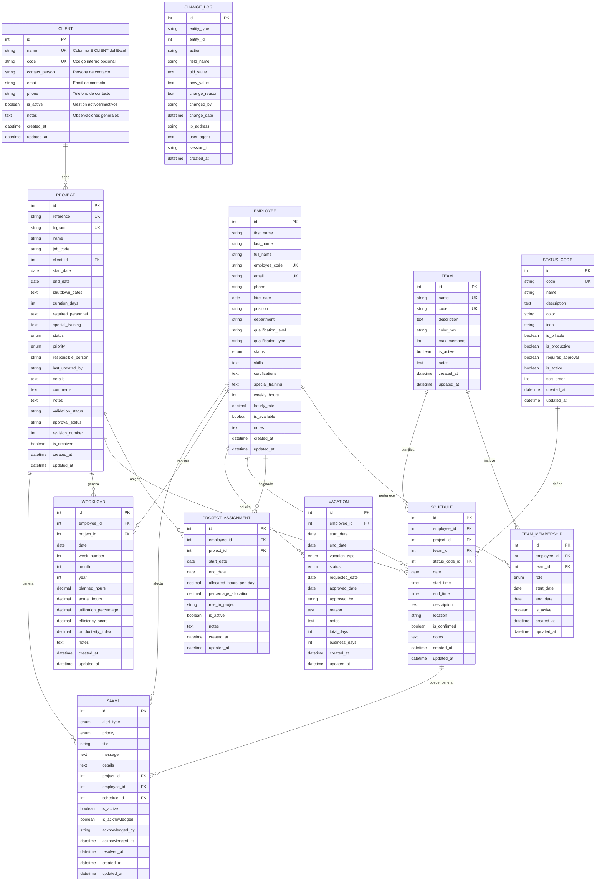

# Diagrama del Esquema de Base de Datos - Sistema de Planificación AkGroup

## Diagrama de Relaciones (ERD)



## Descripción de Relaciones

### 1. Relaciones Principales (1:N)

#### **CLIENT → PROJECT**
- Un cliente puede tener múltiples proyectos
- Cada proyecto pertenece a un solo cliente
- **Clave foránea**: `project.client_id → client.id`

#### **EMPLOYEE → VACATION**
- Un empleado puede tener múltiples vacaciones
- Cada vacación pertenece a un solo empleado
- **Clave foránea**: `vacation.employee_id → employee.id`

#### **STATUS_CODE → SCHEDULE**
- Un código de estado puede usarse en múltiples horarios
- Cada horario tiene un código de estado
- **Clave foránea**: `schedule.status_code_id → status_code.id`

### 2. Relaciones Many-to-Many (N:M)

#### **EMPLOYEE ↔ TEAM** (a través de TEAM_MEMBERSHIP)
- Un empleado puede pertenecer a múltiples equipos
- Un equipo puede tener múltiples empleados
- **Tabla intermedia**: `team_membership`
- **Campos adicionales**: `role`, `start_date`, `end_date`, `is_active`

#### **EMPLOYEE ↔ PROJECT** (a través de PROJECT_ASSIGNMENT)
- Un empleado puede estar asignado a múltiples proyectos
- Un proyecto puede tener múltiples empleados asignados
- **Tabla intermedia**: `project_assignment`
- **Campos adicionales**: `allocated_hours_per_day`, `percentage_allocation`, `role_in_project`

### 3. Relaciones de Planificación

#### **SCHEDULE** (Tabla Central de Planificación)
- **employee_id**: Empleado programado
- **project_id**: Proyecto asignado (opcional)
- **team_id**: Equipo asignado (opcional)
- **status_code_id**: Estado de la actividad
- Permite planificación flexible por empleado, proyecto o equipo

#### **WORKLOAD** (Métricas de Carga)
- **employee_id**: Empleado
- **project_id**: Proyecto (opcional)
- Registra métricas de trabajo por empleado y proyecto
- Permite análisis de utilización y eficiencia

## Índices y Restricciones

### Índices Principales
```sql
-- Índices para consultas frecuentes
CREATE INDEX idx_employee_status ON employees(status);
CREATE INDEX idx_employee_full_name ON employees(full_name);
CREATE INDEX idx_project_reference ON projects(reference);
CREATE INDEX idx_project_client ON projects(client_id);
CREATE INDEX idx_schedule_employee_date ON schedules(employee_id, date);
CREATE INDEX idx_schedule_project_date ON schedules(project_id, date);
CREATE INDEX idx_workload_employee_date ON workloads(employee_id, date);

-- Búsquedas por vacaciones
CREATE INDEX idx_vacation_employee_dates ON vacation(employee_id, start_date, end_date);

-- Búsquedas por asignaciones de proyecto
CREATE INDEX idx_project_assignment_project ON project_assignment(project_id);
CREATE INDEX idx_project_assignment_employee ON project_assignment(employee_id);

-- Búsquedas por estado y fechas
CREATE INDEX idx_schedule_status_date ON schedule(status_code_id, date);
CREATE INDEX idx_project_status_dates ON project(status, start_date, end_date);

-- Búsquedas por equipo
CREATE INDEX idx_team_membership_team ON team_membership(team_id);
CREATE INDEX idx_team_membership_employee ON team_membership(employee_id);

-- Índices para auditoría y seguimiento
CREATE INDEX idx_change_log_entity ON change_log(entity_type, entity_id, change_date);
CREATE INDEX idx_change_log_user_date ON change_log(changed_by, change_date);

-- Índices para alertas
CREATE INDEX idx_alert_type_priority ON alert(alert_type, priority, is_active);
CREATE INDEX idx_alert_project_active ON alert(project_id, is_active);
CREATE INDEX idx_alert_employee_active ON alert(employee_id, is_active);
CREATE INDEX idx_alert_created_date ON alert(created_at, is_active);
```

### Restricciones Únicas
```sql
-- Evitar duplicados en asignaciones
ALTER TABLE project_assignment ADD CONSTRAINT uk_project_employee 
    UNIQUE (project_id, employee_id);

-- Evitar duplicados en membresías de equipo
ALTER TABLE team_membership ADD CONSTRAINT uk_team_employee 
    UNIQUE (team_id, employee_id);

-- Evitar duplicados en horarios
ALTER TABLE schedule ADD CONSTRAINT uk_employee_date_project 
    UNIQUE (employee_id, date, project_id);

-- Códigos únicos
ALTER TABLE status_code ADD CONSTRAINT uk_status_code 
    UNIQUE (code);

-- Trigramas únicos de proyectos
ALTER TABLE project ADD CONSTRAINT uk_project_trigram 
    UNIQUE (trigram);

-- Empleados únicos por email
ALTER TABLE employee ADD CONSTRAINT uk_employee_email 
    UNIQUE (email);

-- Clientes únicos por código
ALTER TABLE client ADD CONSTRAINT uk_client_code 
    UNIQUE (code);

-- Evitar duplicados con fechas
ALTER TABLE team_membership ADD CONSTRAINT uq_team_membership 
    UNIQUE (employee_id, team_id, start_date);
    
ALTER TABLE project_assignment ADD CONSTRAINT uq_project_assignment 
    UNIQUE (employee_id, project_id, start_date);
    
ALTER TABLE workload ADD CONSTRAINT uq_workload_employee_date 
    UNIQUE (employee_id, date);
```

## Flujo de Datos

### 1. Entrada Manual de Datos
```
Formularios Web → Validación → Base de Datos
├── Clientes (registro manual)
├── Proyectos (creación paso a paso)
├── Empleados (registro con cualificaciones)
├── Planificación (interfaz de calendario)
└── Códigos de Estado (configuración personalizable)
```

### 4. Proceso de Configuración Manual
1. **Configuración Inicial del Sistema**
   - Asistente de configuración paso a paso
   - Definición de parámetros del sistema
   - Configuración de cualificaciones del personal (HN1, HN2, etc.)
   - Establecimiento de reglas de negocio

2. **Creación de Códigos de Estado**
   - Definición manual de códigos de estado
   - Configuración de colores y categorías
   - Establecimiento de reglas de facturación

3. **Registro de Datos Maestros**
   - Creación/registro de empleados con cualificaciones
   - Registro de proyectos con trigramas únicos
   - Configuración de horarios con códigos de color
   - Cálculo automático de cargas de trabajo
   - Registro automático de cambios en ChangeLog

4. **Validaciones en Tiempo Real**
   - Verificación de integridad referencial
   - Validación de fechas y rangos
   - Control de duplicados
   - Verificación de estados válidos
   - Generación automática de alertas por personal insuficiente
   - Detección de conflictos de disponibilidad

### 2. Operaciones Principales

#### 2.1 Configuración y Entrada de Datos
```
⚙️ CONFIGURACIÓN INICIAL:
├── Asistente de configuración paso a paso
├── Definición de parámetros del sistema
├── Configuración de cualificaciones del personal (HN1, HN2, etc.)
├── Establecimiento de reglas de negocio
├── Creación de códigos de estado personalizables
└── Configuración de colores y categorías

📝 ENTRADA MANUAL DE DATOS:
├── Registro de empleados con cualificaciones
├── Creación de proyectos con trigramas únicos
├── Registro de clientes con información completa
├── Configuración de horarios con códigos de color
├── Programación de vacaciones con validación
└── Definición de equipos y membresías
```

#### 2.2 Consultas y Reportes
```
📊 CONSULTAS FRECUENTES:
├── Disponibilidad de empleados por fecha y cualificación
├── Carga de trabajo por proyecto y empleado
├── Horarios por empleado/semana con códigos de color
├── Vacaciones programadas y conflictos
├── Asignaciones activas por proyecto y cualificación
├── Reportes de productividad por cualificación
├── Alertas activas por tipo y prioridad
├── Historial de cambios por entidad
└── Personal disponible por cualificación (HN1, HN2, etc.)
```

#### 2.3 Gestión Operativa
```
🔄 OPERACIONES CRUD:
├── Gestión de empleados con cualificaciones
├── Administración de proyectos con trigramas
├── Programación de horarios con validación
├── Registro de vacaciones con alertas
├── Seguimiento de cargas de trabajo
├── Configuración de códigos de estado y colores
├── Gestión de alertas y notificaciones
├── Auditoría y seguimiento de cambios
└── Validación de disponibilidad incierta

🚨 SISTEMA DE ALERTAS:
├── Personal insuficiente por cualificación
├── Conflictos de programación
├── Cambios críticos en proyectos
├── Disponibilidad incierta de empleados
└── Validaciones pendientes

🔄 FLUJO PRINCIPAL:
1. Configurar Sistema → Registrar Empleados → Crear Clientes
2. Crear Proyecto → Asignar Empleados → Formar Equipos
3. Planificar Horarios → Validar Disponibilidad → Registrar Workload
4. Solicitar Vacación → Aprobar → Actualizar Disponibilidad
```

### 3. Consultas Típicas
```sql
-- Empleados disponibles en una fecha
SELECT e.* FROM employees e
LEFT JOIN schedules s ON e.id = s.employee_id AND s.date = '2024-01-15'
LEFT JOIN vacations v ON e.id = v.employee_id 
    AND '2024-01-15' BETWEEN v.start_date AND v.end_date
WHERE s.id IS NULL AND v.id IS NULL AND e.is_available = true;

-- Carga de trabajo por proyecto
SELECT p.name, SUM(w.planned_hours) as total_planned, 
       SUM(w.actual_hours) as total_actual
FROM projects p
JOIN workloads w ON p.id = w.project_id
WHERE w.date BETWEEN '2024-01-01' AND '2024-01-31'
GROUP BY p.id, p.name;

-- Empleados por equipo con roles
SELECT t.name as team_name, e.full_name, tm.role
FROM teams t
JOIN team_memberships tm ON t.id = tm.team_id
JOIN employees e ON tm.employee_id = e.id
WHERE tm.is_active = true
ORDER BY t.name, tm.role;
```

## Consideraciones de Diseño

### Ventajas del Esquema
1. **Flexibilidad**: Permite asignaciones múltiples y roles diversos
2. **Escalabilidad**: Estructura normalizada para crecimiento
3. **Integridad**: Restricciones y validaciones robustas
4. **Auditoría**: Campos de timestamp en todas las tablas
5. **Performance**: Índices optimizados para consultas frecuentes

### Patrones Implementados
1. **Soft Delete**: Campos `is_active` en lugar de eliminación física
2. **Audit Trail**: `created_at` y `updated_at` automáticos
3. **Lookup Tables**: `status_codes` para valores configurables
4. **Bridge Tables**: Para relaciones many-to-many con metadatos
5. **Temporal Data**: Fechas de inicio/fin para historiales

### Escalabilidad
- **Particionamiento por fechas**: Las tablas `schedule` y `workload` pueden particionarse por año/mes
- **Archivado de datos históricos**: Mover registros antiguos a tablas de archivo
- **Índices optimizados**: Para consultas frecuentes por empleado, proyecto, fecha y cualificación
- **Sistema de alertas escalable**: Procesamiento asíncrono de notificaciones

### Performance
- **Desnormalización controlada**: Campos calculados en `workload` para evitar agregaciones costosas
- **Caché de consultas**: Para reportes frecuentes de disponibilidad por cualificación
- **Índices compuestos**: Para búsquedas multi-criterio (cualificación + disponibilidad)
- **Optimización de alertas**: Índices específicos para consultas de alertas activas

### Integridad de Datos
- **Sistema de auditoría completo**: ChangeLog para rastrear todos los cambios
- **Validaciones a nivel de base de datos**: Constraints para reglas de negocio
- **Soft deletes**: Marcado lógico en lugar de eliminación física
- **Validación de cualificaciones**: Constraints para niveles válidos (HN1, HN2, etc.)
- **Control de concurrencia**: Para evitar conflictos en asignaciones simultáneas

### Sistema de Alertas
- **Procesamiento en tiempo real**: Triggers para generar alertas automáticas
- **Priorización inteligente**: Sistema de prioridades para alertas críticas
- **Notificaciones configurables**: Diferentes canales según tipo de alerta
- **Historial de alertas**: Seguimiento completo de alertas generadas y resueltas

### Mantenimiento
- **Versionado de esquema**: Con Alembic para migraciones
- **Backup automático**: Estrategia de respaldo incremental
- **Monitoreo avanzado**: Logs de performance, alertas y cambios críticos
- **Limpieza automática**: Archivado de logs antiguos y alertas resueltas
- **Validación de integridad**: Procesos automáticos de verificación de datos

Este esquema proporciona una base sólida para el sistema de planificación, permitiendo gestión completa de empleados, proyectos, equipos y planificación con flexibilidad para futuras extensiones.

## Simplificación del Modelo PROJECT - Eliminación de Campos Financieros

### Campos Eliminados
Se han eliminado los siguientes campos financieros del modelo `PROJECT`:
- `budget` (Numeric): Presupuesto del proyecto
- `actual_cost` (Numeric): Costo real del proyecto

### Justificación de la Eliminación

#### 1. **Enfoque MVP (Minimum Viable Product)**
- El sistema se centra inicialmente en la planificación y gestión de recursos humanos
- Los aspectos financieros pueden agregarse en versiones posteriores
- Simplifica la entrada de datos y reduce la complejidad inicial

#### 2. **Separación de Responsabilidades**
- La gestión financiera puede manejarse en sistemas especializados
- Evita duplicación de datos con sistemas contables existentes
- Permite integración futura con sistemas ERP

#### 3. **Beneficios Operativos**
- **Entrada de datos más rápida**: Menos campos obligatorios en formularios
- **Menor complejidad de validación**: Sin necesidad de validar montos y presupuestos
- **Enfoque en planificación**: Concentración en asignación de recursos y cronogramas
- **Flexibilidad futura**: Fácil adición posterior sin afectar funcionalidad existente

#### 4. **Escalabilidad**
- **Módulo financiero independiente**: Posibilidad de crear módulo especializado
- **Integración externa**: Conexión con sistemas contables establecidos
- **Permisos granulares**: Control de acceso diferenciado para datos financieros

### Extensibilidad Futura
Cuando se requiera funcionalidad financiera, se puede:
1. **Agregar tabla separada**: `PROJECT_FINANCIALS` con relación 1:1
2. **Módulo independiente**: Sistema financiero con API de integración
3. **Campos opcionales**: Reintroducir campos como opcionales
4. **Integración ERP**: Conectar con sistemas empresariales existentes

Esta simplificación mantiene el foco en la gestión de recursos humanos y planificación, que son los objetivos principales del sistema.
